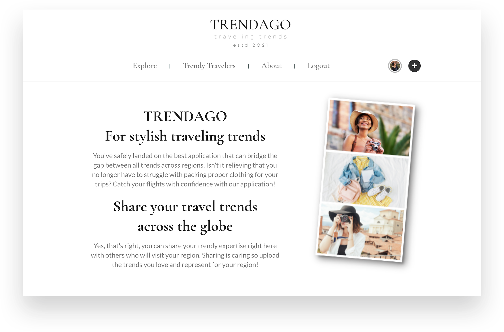

Front End Capstone | TRENDAGO by Brittany Garrett: 

Why TRENDAGO: 
This Reat.JS application was built in order to practice using the newest knowledge learned during the first portion of my instruction with the Nashville Software School (NSS). While building this application, I wanted to have fun but also take on challenges that I knew would help me with my future projects and future software development positions. I wanted to make sure it was very user-friendly but also simple & effective.

Learning goals: 
- Practice using JavaScript and JSX within React to create a simple application with clean visuals and functionality
- Deepen my understanding of and learn to properly use asynchronous APIs, React hooks and JSX together for application rendering
- Strengthen my CSS styling for a fluid user experience while also getting better acquainted with external pre-packaged npm components
- Properly organize, plan, wireframe and  build an operating React app from a thorough idea to a usable MVP 

Prolems & Solution:  
Packing for unique travel destinations can be overwhelming especially if it's a first time experience traveling to a new region. With TRENDAGO, you can search for current trends by keywords that match the user to pre-assembled fashion suggestions. Keywords include region names, climate terms, and/or clothing or accessory types. Users can also upload their own suggested trends according to their region and/or regions they have visited.

Project features:
Features within my application include: 
- Filtering by keyword and typed in search terms 
- Browsing a hard coded, self made API library of items including their descriptions and imagery
- Profiles for each user with a tailored view from the point of view of the currently logged in user
- The proper save button toggle for saving and unsaving items for later view within the current profile
- View of all users within the application and their profile including the items they have uploads and the items they have saved for later reference
- The ability to add new items/clothing as well as edit and delete the item and details.
- User friendly navigation and clean user experience
- Login/logout smoothly (with only email address, no passcode)
- Link to github repo of capstone within footer

Tech stack:
- React.JS
- JSX
- Semantics UI
- HTML/CSS
- Canva

Challenges:  
One of the biggest challenges I had was to compare the current users saved items to the entire list of items within the application on the explorer page as well as compare the current users saved items against each individual profile that has been visited that is not the currently logged in user's page. Initially, making the comparison wasn't too difficult. But later, when using ternaries to output the proper state of the saved item's button (blue, black or none if the item is owned by the current logged in user), that's when it became tricky. It took me some days/about 2 weeks to finally get that feature to smoothly run and reflect the proper states while navigating through the application. We were given about a month to get the MVP version together. If I didn't spend that time trying to figure that out, my application would not look or work the way I wanted it to. 

Personal lessons: 
- Find a place that is distraction free to be most productive 
- Reach outside of your comfort zone for help! Whether through classmates or alum. Growth only happens in discomfort
- Take breaks but celebrate small victories! They add to the overall progress of the project
- It's YOU vs. YOU so strive to be better each day. Make your past self proud!

Screenshots: 

